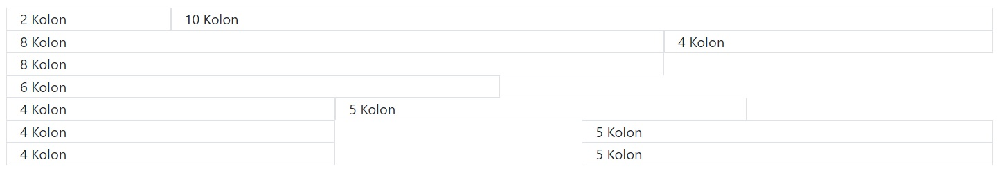
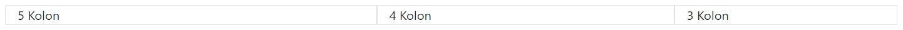
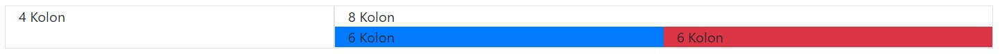
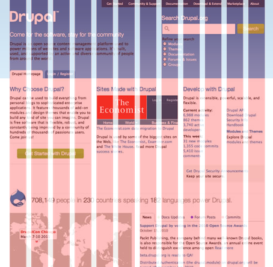
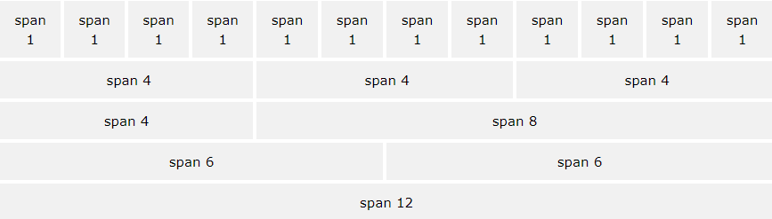
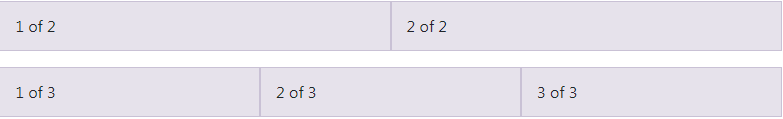

# BOOTSTRAP

## KURULUMU

Bootstrap i html sayfamıza kurmak için, bootstrap in sayfasına gelip sayfada belirtilen kurulum kodunu kopyalayıp kendi sayfamıza dahil etmemiz yeterli olacaktır. Daha fazla bilgi için [tıklayınız](https://getbootstrap.com/docs/5.3/getting-started/introduction/).

## 12'lik Izgara(Grid) Sistemini Anlamak

Bootstrap, sayfa düzeni (layout) oluşturmak için, CSS flexbox ile oluşturulmuş ızgara (grid) sistemini kullanmaktadır.

Bootstrap ızgara sistemi 3 ana yapıdan oluşur:

1- Kapsayıcı (.container)

2- Satırlar (.row)

3- Kolonlar (col-\*) (Örnek: .col-md-8)

Her bir sütun, 12 kolondan meydana gelmekte ve 12'lik Grid sistemi oluşturmaktadır. 12'lik ızgara sisteminde, kolon sayısı varyasyonları ile istenildiği gibi tasarım yapılabilmektedir.

Her bir sayfayı 12 dikey parçadan olduğunu düşünürsek genelde sayfalar 12'lik yapıdan oluşur. Container yani ana tutucu dediğimiz bizim sayfada gördüğümüz genel yapının 12 parçadan oluştuğunu düşünürsek bu yapıyı 12 parçaya ayırmak için "row" sistemini kullanıyoruz yani satırları. 12 lik yapının içerisinde kaç tane kolon kullanacağımız belirtmek içn de "col" u kullanıyoruz.
Örnek:

```
 <div class="row">
    <div class="col">Kolon</div>
    <div class="col">Kolon</div>
    <div class="col">Kolon</div>
    <div class="col">Kolon</div>
    <div class="col">Kolon</div>
    <div class="col">Kolon</div>
    <div class="col">Kolon</div>
    <div class="col">Kolon</div>
    <div class="col">Kolon</div>
    <div class="col">Kolon</div>
    <div class="col">Kolon</div>
    <div class="col">Kolon</div>
 </div>  ---> bu tek satırlık 12 parça oluşturur.
 ```
 
```
<div class="row">
    <div class="col-2">Kolon</div>
    <div class="col-2">Kolon</div>
    <div class="col-2">Kolon</div>
    <div class="col-2">Kolon</div>
    <div class="col-2">Kolon</div>
    <div class="col-2">Kolon</div>
</div>  ---> bu 2 satırlık 6 adet parça oluşturur.
```
```
<div class="row">
    <div class="col-3">Kolon</div>
    <div class="col-3">Kolon</div>
    <div class="col-3">Kolon</div>
    <div class="col-3">Kolon</div>
</div>  ---> bu 3 satırlık 4 adet kolon oluşturur.
```
### EŞİT OLMAYAN KOLONLAR

Kolon sayılarının 12'ye tamamlanma zorunluluğu yoktur. Tasarıma göre istenilen sayıda kolonlar oluşturulabilir ve istenilen yerlerde boşluk bırakılabilir.

1 adet 2'li kolon (.col-[sınıfAdı]-2) ile 1 adet 10'lu kolon (.col-[sınıfAdı]-10) ya da 1 adet 8'li kolon (.col-[sınıfAdı]-8) ile 1 adet 4'lü kolon (.col-[sınıfAdı]-4) 12'ye tamamlanabilir.

Tek bir adet 8'li kolon (.col-[sınıfAdı]-8), tek bir adet 6'lı kolon (.col-[sınıfAdı]-6) ya da 1 adet 4'lü kolon (.col-[sınıfAdı]-4) ile 1 adet 5'li kolon (.col-[sınıfAdı]-5) kolon 12'ye tamamlanmadan bıraklabilir. Böylece eksik bırakılan kolon değeri kadar yan tarafta boşluk kalmış olur.

Verilen kolon değerlerinin toplamı 12'den fazla olması durumunda son kolon bloğu bozmayacağı için alt tarafa geçer. 

* Örneğin; 1 adet 8'li kolondan sonra 1 adet 6'lı kolon değeri verilir ise 8 + 6 = 14 toplam kolon sayısı 12'den büyük olacağı için 6'lı kolon 8'li kolonun altına geçer.

```
<div class="row">
    <div class="col-2">2 Kolon</div>
    <div class="col-10">10 Kolon</div>
</div>  --> önce 2 kolonluk bir kutucuk, yanına 10 kolonluk bir kutucuk gelir.
```
```
<div class="row">
    <div class="col-8">8 Kolon</div>
    <div class="col-4">4 Kolon</div>
</div>  --> önce 2 kolonluk bir kutucuk, yanına 10 kolonluk bir kutucuk gelir.
```
```
<div class="row">
    <div class="col-8">8 Kolon</div>
    <div class="col-6">6 Kolon</div>
</div>  --> sığmadığı için 6 numaralı kolon 8 numaralı kolonun altına geçer.
```

Kolonların arasında da boşluk bırakmak mümkün. Bunun için col sınıfının yanına öntanımlı margin ve margin yönünü (ml-auto gibi) belirten bir sınıf adı daha eklenmelidir. Kolonun solunda boşluk bırakmak için margin (m) left (l) yani ml-auto sınıfı eklemeli, aynı şekilde sağ tarfında boşluk bırakılmak istenirse margin (m) right (r) yani mr-auto sınıfı eklemelidir.

* Örneğin; col-4 mr-auto sınıfı olan bir kolonun sağ tarafında, col-4 ml-auto sınıfı ise kolonun solunda boşluk bırakır.

```
<div class="row">
    <div class="col-4 mr-auto">4 Kolon</div>
    <div class="col-5">5 Kolon</div>
</div>  --> 4 numaralı kolonun sağına boşluk bırakır.

<div class="row">
    <div class="col-4">4 Kolon</div>
    <div class="col-5 ml-auto">5 Kolon</div>
</div>  --> 5 numaralı kolonun soluna boşluk bırakır.
```


## KOLONLARIN SIRALANMASI

Öntanımlı order-[sıra numarası] sınıfını ekleyerek kolonları sıralayabiliriz.

* Örneğin; col-3 order-3 üç kolonluk bölümü üçüncü sıraya yerleştirecektir.

```
<div class="row">
    <div class="col-3 order-3">3 Kolon</div>
    <div class="col-4 order-2">4 Kolon</div>
    <div class="col order-1">5 Kolon</div>
</div>
```


## İÇ İÇE IZGARA SİSTEMİ

Bir satırdaki (row) kolonun (col) içine başka bir satır eklenerek yine kolonlara bölünebilir.

Örneğin; 4'lük bir kolon (.col-[sınıfAdı]-4) ile 8'lik bir kolondan (.col-[sınıfAdı]-8) oluşan satırdaki 8'lik kolonun içinde yeni bir satır (row) eklenerek 2 adet 6'lık kolon (.col-[sınıfAdı]-6) oluşturulabilir.

```
<div class="row">
    <div class="col-4">4 Kolon</div>
    <div class="col-8">
        8 Kolon
        <div class="row">
            <div class="col-6">6 Kolon</div>
            <div class="col-6">6 Kolon</div>
        </div>
    </div>
</div>
```


## ROW VE COLUMN YAPISI

Row(satır), column(sütun) sistemi Bootstrap'in grid system(ızgara sistemi) denilen düzenini oluşturuyor. Grid system ile bir web sayfası 12 adet sütuna bölünmüş ve sayfanın içeriği bu sütunların boyutlarına göre düzenlenmiş diyebiliriz. Genel olarak göstermek gerekirse aşağıdaki resim örnek bir sayfanın 12 adet sütuna bölündüğünde hangi içeriğin hangi sütunlar boyutunda olacağını, aralarındaki boşlukları göstermektedir.



İçeriklerimizin genişliğini sütun yapısına göre belirliyoruz demiştik. Yani sayfamızda paylaşmak istediğimiz bir yazı, 12 sütunun 3 tanesini kapsayacak genişlikte olsun, kalan 9 sütun ise bir resim için ayrılmış olsun. Peki içeriklerin uzunluğunu neye göre belirliyoruz? İşte burada da satırları kullanıyoruz. Sayfamızı yukardan aşağıya satırlara bölüyoruz ve her satırın içerisinde ayrı ayrı sütun sayısı, boyutu belirleyebiliyoruz. Bu şekilde satırları ve sütunları bir container içerisinde kullandığımızda grid system uygulamış oluyoruz. Kafa karıştırıcı gibi gözükebilir ancak aşağıdaki resmi incelediğimizde her şey çok net anlaşılacaktır.



* İlk Satır Birbirine Eşit Boyutta 12 Adet Sütundan

* İkinci Satır Birbirine Eşit Boyutta 3 Adet Sütundan

* Üçüncü Satır 2 Farklı Boyutta Sütundan

* Dördüncü Satır 2 Eşit Boyutta Sütundan

* Beşinci Satır İse Tek Bir Sütundan Oluşmaktadır.

Görüldüğü gibi 12 adet sütun yapısını istediğimiz biçimde birleştirerek, ayırarak satırlar ile birlikte kullanarak tasarımımızı yapabiliriz.

Son olarak ise grid yapısını oluşturmak için nasıl bir kod yapısı kullanmamız gerektiğini basit bir örnek ile anlamaya çalışalım.



* Bu resimde gördüğümüz 2 satırdan oluşan grid yapısını aşağıdaki kod ile oluşturabiliriz.
```
<div class="container">
  <div class="row">
    <div class="col">
      1 of 2
    </div>
    <div class="col">
      2 of 2
    </div>
  </div>
  <div class="row">
    <div class="col">
      1 of 3
    </div>
    <div class="col">
      2 of 3
    </div>
    <div class="col">
      3 of 3
    </div>
  </div>
</div>
```
div HTML tag'lerine class="row" veya class="col" sınıfları vererek bu tag'lerin ne amaçla kullanılacağını belirttik. Ayrıca dikkat ederseniz bu grid bir class="container" içerisinde bulunmakta.

## BOOTSTRAP - EKRAN ÇÖZÜNÜRLÜĞÜ / CİHAZ DUYARLI (RESPONSİVE) KOLON YAPISI KULLANIMLARI

## GRİD OPTİONS

[İlgili Video](https://youtu.be/9_mdnDE5UnA)


## Bootstrap Renk Strandartları, Tipografi, Margin ve Padding Kullanımı

[İlgili Video](https://academy.patika.dev/tr/courses/bootstrap/bootstrap-renk-strandartlari,-tipgrafi,-margin-ve-padding-kullanimi)


## DİSPLAY ÖZELLİKLERİ

### Bootstrap’te Display Özellikleri ile Responsive Yapıya Göre İstenilen Blokların Gösterilmesi / Gizlenmesi

Bootstrap 5’teki display özellikleri sayesinde, CSS’teki display özelliği daha kolay bir kullanıma kavuşuyor.

CSS’teki display özelliğini kısaca hatırlayalım.

```
display: none;
/* Elemanı sayfadan tamamen kaldırır */

display: block;
/* Elemente blok seviyesi elementlerin (<div>, <header>, <h1> gibi) görünüm özelliğini kazandırır. */

display: inline;
/* Elemente <span>, <a>,  elementlerinde olduğu gibi, satır içi yerleşim özelliği kazandırır. Element satırı tamamen kaplamaz, içeriği kadar yer kaplar. */

display: inline-block;
/* Elementleri satır içi element gibi yan yana dizmek için kullanılır. */

display: flex;
/* Element inline element gibi davranır ve bunun yanında flexbox modeline uygun görünüme sahip olur. */

display: grid;
/* Element, blok level bir element gibi davranır ve grid model görünümüne uygun davranır. */ 
```

Bootstrap display özelliği sayesinde çok daha kolay bir şekilde responsive uyumlu hazır grid sistemler inşa edebiliriz. Bunun için oluşturacağımız element için class değerine d.{value} girmemiz yeterlidir.

{value} değeri aşağıdakilerden herhangi biri olabilir:

```
none
inline
inline-block
block
grid
table
table-cell
table-row
flex
inline-flex 
```

### Breakpoint’ler

Bootstrap’te ekran boyutları için hazır tanımlamalar bulunmaktadır. Bu tanımlamalara göre elementlerin görünürlüğünü açık/kapalı olarak class tag’inde belirtebiliriz. Bu sayede responsive uyumlu dinamik bir görünüm elde ederiz:

#### Alıştırma

Şimdi, Bootstrap özelliklerini kullanarak 5 adet h1 oluşturalım ve bu h1 elementlerinin display özelliklerini ayarlayalım.

Bootstrap display class’larında ilk belirtilen değer aksi belirtilmedikçe diğer ekran boyutlarında da geçerli olmaktadır. Örneğin XS (mobil) boyutu için görünür olmayan bir element ekstra bir tanım yapılmadıkça diğer ekran boyutlarında da görünür olmayacaktır. XS boyutunda d-none (CSS’teki display:none; ile eşdeğer) olarak tanımlanmış bir elementi MD (Laptop) boyutunda ekranda görünür hale getirmek için

* İlk elementimiz mobil yani “xs” boyutu için görünür olmalı. Bunun için class tag’ine d-block yazmamız gerekiyor ve bu da CSS’teki display:block; satırına eşdeğer. Fakat bir sonraki boyut ve sonrasında elementi gizlemek için display:none; olarak ayarlamamız gerekiyor. Bunun için Bootstrap’te sonraki boyut olan “sm” boyutu için d-sm-none tanımlamasını yapıyoruz. Böylece sm ve daha sonraki ekran boyutları için display:none tanımlamasını yapmış oluyoruz:
```
<h1 class="d-block d-sm-none bg-warning p-5 text-white mx-auto">XS - Birinci Element - Mobil Görünüm</h1>
```
* Bir sonraki h1 elementi için ise sadece sm ekran boyutunda görünür olmasını istiyoruz. Bunun için standart olarak d-none özelliği tanımlayıp ardından sm ekran boyutu için d-sm-block tanımlaması yapıyoruz. Sonraki ekran boyutları için elementi gizlemenin yolu ise, bir sonraki ekran boyutunda yine display:none tanımlaması yapmak. Bunun için d-md-none yazabiliriz:
```
<h1 class="d-none d-sm-block d-md-none bg-primary p-5 text-white mx-auto">SM - İkinci Element - Tablet Görünüm</h1>
```
* Sonraki h1 elementinde sadece md ekran boyutunda görünür olması için varsayılan olarak d-none tanımlaması yapıp ardından d-md-block yazmalıyız. Sonraki ekran boyutlarında görünürlüğü kapatmak için ise d-lg-none yazmamız yeterli olacaktır:
```
<h1 class="d-none d-md-block d-lg-none bg-success p-5 text-white mx-auto">MD - Üçüncü Element - Laptop Görünüm</h1>
```
* Sonraki h1 elementinde önce d-none, ardından lg ekran boyutunda görünür hale getirmek için d—lg-block, sonraki ekran boyutlarında gizli hale getirmek için ise d-xl-none yazabiliriz:
```
 <h1 class="d-none d-lg-block d-xl-none bg-danger p-5 text-white mx-auto">LG - Dördüncü Element - Normal Ekran Görünüm</h1>
 ```
* Son ekran boyutunda görünmesini istediğimiz h1 elementini ise varsayılan olarak d-none şeklinde ayarlıyoruz. Ardından d-xl-block yazmamız yeterli olacaktır. Bu ekrandan daha büyük tanımlı bir ekran bulunmadığı için, başka bir tanımlama yapmamıza gerek yoktur:
```
<h1 class="d-none d-xl-block bg-info p-5 text-white mx-auto">XL - Beşinci Element - Büyük Ekran Görünüm</h1>
```

## OFFSET KULLANIMI

Offset container daki yapımızda değişiklik yapmamıza ve yeriyle oynamamızı sağlar. örneğin 6 sütunluk bir yapı sola dayalı bir şekilde duruyorsa bunu 3 sütun sağda ve 3 sütun sola boş kalacak şekilde kaydırarak container ımızı ortalayabiliriz.

Örnek kullanım için "offset.html" sayfasında footer kısmına bakabilrsin.